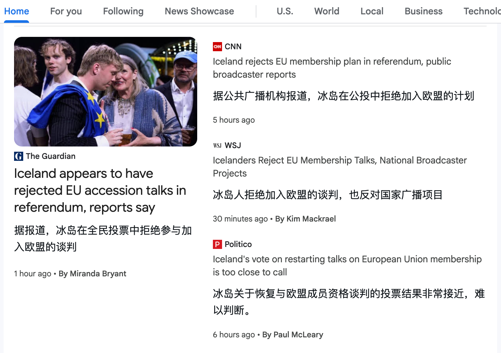
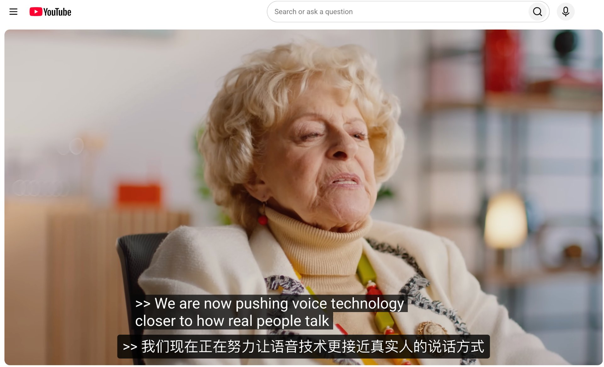
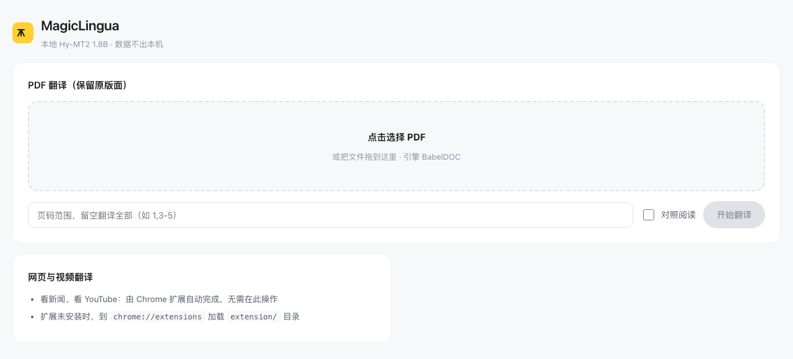
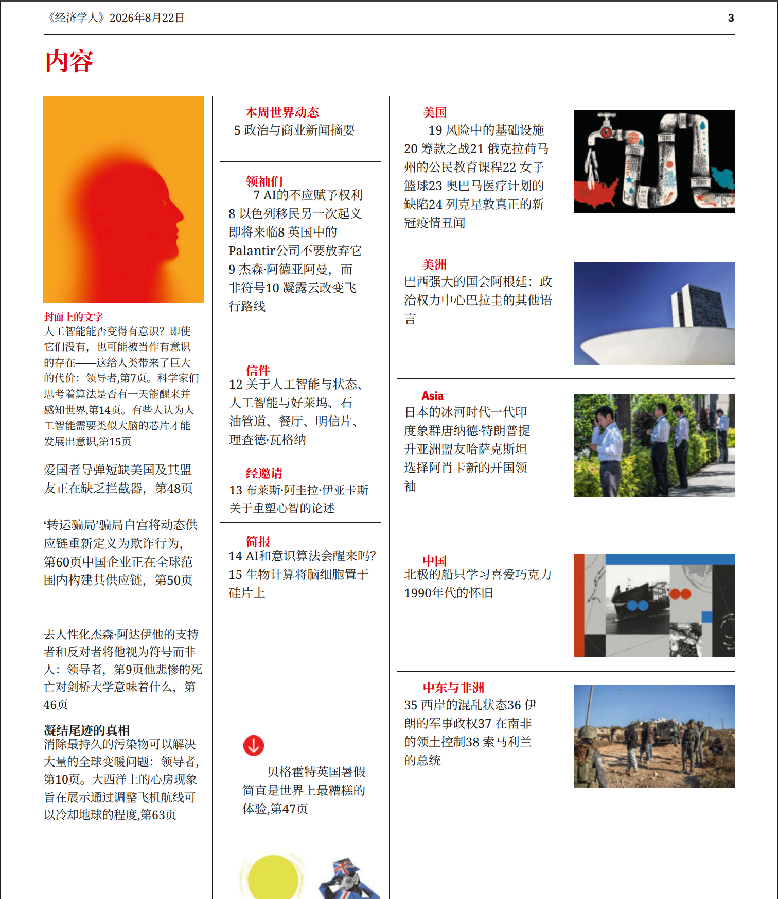
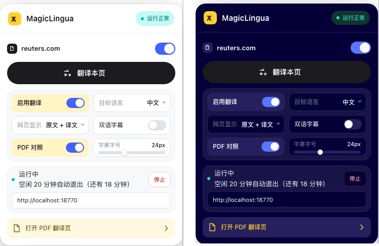

<div align="center">

# 🚂 MagicLingua

**完全本地运行的浏览器翻译助手** — 网页整页翻译 · YouTube 双语字幕 · PDF 保留版面翻译

本地推理 · 隐私优先 · HY-MT2 模型 · GGUF 量化 · 33 种语言 · 按需启停 · 永久免费开源

[](https://github.com/jinleiviva/magiclingua/releases)
[](LICENSE)
[](https://huggingface.co/tencent/Hy-MT2-1.8B-GGUF)
[](README.md)
[](LICENSE)

</div>

> ⚠️ **地域限制**：翻译模型采用 *Tencent HY Community License Agreement*，**不适用于欧盟、英国、韩国**，请勿在上述地区使用或分发。模型许可全文见 [`MODEL_LICENSE.txt`](MODEL_LICENSE.txt)，商标与署名要求见 [`NOTICE`](NOTICE)。

---

## 📖 目录

- [English Summary](#english-summary)
- [为什么做这个项目](#为什么做这个项目)
- [效果一览](#效果一览)
- [核心能力](#核心能力)
- [快速开始](#快速开始)
- [使用指南](#使用指南)
- [配置参考](#配置参考)
- [常见问题](#常见问题)
- [项目结构](#项目结构)
- [参与贡献](#参与贡献)
- [致谢](#致谢)
- [许可证](#许可证)

---

## English Summary

MagicLingua is a fully local, privacy-first browser translation assistant: full-page web translation, YouTube bilingual subtitles, and layout-preserving PDF translation — all powered by an on-device HY-MT model (llama.cpp + GGUF, ~1.1 GB). **Nothing ever leaves your machine.**

It started as a personal side project and is now **free and open source (MIT) forever** — contributions to cover more sites, PDF layouts, and video platforms are very welcome.

Quick start: ① `./setup_env.sh` ② `./download_model.sh` ③ `./start_server_gguf.sh`, then load `extension/` via `chrome://extensions` (Developer Mode), and run `./native_host/install.command` (macOS) for one-click service start/stop from the popup. The documentation below is in Chinese; issues and PRs in English are welcome.

> The bundled translation model is licensed under the *Tencent HY Community License Agreement*, which **does not apply to the EU, UK, or South Korea** — see [`MODEL_LICENSE.txt`](MODEL_LICENSE.txt).

---

## ✨ 为什么做这个项目

MagicLingua 最初只是**写给我自己用**的一个小工具。

我每天要读大量的英文内容——新闻、期刊、长视频。市面上的翻译服务当然好用，但随着硬件和开源模型的进步，商用级翻译模型可以在普通机器上也跑起来了，免费、好用的翻译插件就来到了我的眼前。

当我第一次在自己电脑上跑通混元翻译模型时、看到译文几乎不输商用服务的那一刻，想法就很简单——

> **既然我自己能免费用上商用级的翻译效果，那为什么不让更多人也能用上？**

于是有了这个插件。它完全跑在你自己的电脑上，模型只有 1.1 GB，不需要账号、不花一分钱，对于要看敏感内容的人群来说，也没有任何内容会离开你的机器。

我知道它现在还不够好：站点适配可以更多，PDF 版面还能更精细，字幕场景还可以更丰富。**我一个人能覆盖的场景有限，所以把它完整开源出来**——如果你也有"想读却读不动"的外语内容，欢迎一起来完善它，让它覆盖更多人的真实场景。

**本插件永久免费，永久开源（MIT）。**

---

## 🖼️ 效果一览

<table>
  <tr>
    <td width="50%" align="center">
      <a href="docs/screenshot-web.png">
        
      </a>
      <br>
      <sub>🌍 网页整页翻译 · Google News 就地替换，版式不乱</sub>
    </td>
    <td width="50%" align="center">
      <a href="docs/screenshot-youtube.jpg">
        
      </a>
      <br>
      <sub>🎬 YouTube 双语字幕 · 原字幕与译文同屏对照</sub>
    </td>
  </tr>
  <tr>
    <td width="50%" align="center">
      <a href="docs/screenshot-pdf.png">
        
      </a>
      <br>
      <sub>📄 PDF 翻译助手 · 自动解析目录，勾选要翻的文章</sub>
    </td>
    <td width="50%" align="center">
      <a href="docs/screenshot-pdf-result.png">
        
      </a>
      <br>
      <sub>📑 PDF 翻译成品 · 排版、配图、分栏原样保留</sub>
    </td>
  </tr>
</table>

<p align="center">
  <sub>⚙️ 插件面板：站点能力开关 + 本地服务一键启停（点图标看大图）</sub>
</p>
<p align="center">
  <a href="docs/screenshot-popup.png">
    
  </a>
</p>

---

## 🚀 核心能力

| 能力 | 说明 |
| --- | --- |
| 🌍 **网页整页翻译** | 通用站点适配，译文就地替换，原版式不乱 |
| 🎬 **YouTube 双语字幕** | 原字幕与译文同屏对照，视频照看不误 |
| 📄 **PDF 保留版面翻译** | 解析目录 → 勾选文章 → 只翻选中页，成品写回书签；扫描件走本机 OCR（macOS Vision） |
| 🔒 **隐私优先** | 模型跑在本机（llama.cpp + GGUF），译文与文档零上传 |
| ⚡ **按需启停** | 服务闲置 20 分钟自动退出、内存归零；点插件即拉起 |
| 🔌 **OpenAI 兼容 API** | `http://localhost:18770/v1/chat/completions`，可接入其他工具 |
| 🧠 **33 种语言互译** | 中 / 英 / 日 / 韩 / 法 / 德 / 西 / 俄 / 阿 / 葡 等 |

同一套本地服务同时驱动扩展与 PDF 助手，模型约 1.1 GB（Q4_K_M 量化），近五年内的电脑（带不带独显）都能跑。

---

## ⚡ 快速开始

一共三步：**装本地服务 → 下模型 → 装扩展**。全程无需云账号、无需 GPU。

### 1️⃣ 本地服务（macOS / Linux / Windows）

环境要求：**Python 3.9+**（推荐 3.11+）、内存 4 GB+、磁盘约 3 GB。

```bash
git clone https://github.com/jinleiviva/magiclingua.git && cd magiclingua
./setup_env.sh          # 创建 venv 并安装真实最小依赖（Flask / llama-cpp-python / PyMuPDF / BabelDOC 等）
./download_model.sh     # 下载 Hy-MT2-1.8B GGUF（约 1.1 GB，默认走 hf-mirror 镜像）
./start_server_gguf.sh  # 启动服务，看到 ✅ 即成功；日志在 log_server.txt
```

模型**不会自动下载**，必须执行一次 `download_model.sh`。换模型版本：

```bash
MODEL_REPO=tencent/Hy-MT2-7B-GGUF MODEL_FILE=Hy-MT2-7B.Q4_K_M.gguf ./download_model.sh
```

> 💡 **Windows 用户**：`setup_env.sh` / `start_server_gguf.sh` 逻辑通用，请在 Git Bash / WSL 中执行；「服务管理器」安装脚本目前仅 macOS（见第 3 步）。

### 2️⃣ Chrome 扩展

1. Chrome 打开 `chrome://extensions`，开启右上角「**开发者模式**」
2. 点「**加载已解压的扩展程序**」，选择本仓库的 `extension/` 目录
3. 点插件图标确认面板出现即装好

> 开发者模式加载的扩展，ID 由**扩展目录路径**决定：目录不动，重载 / 更新代码 ID 恒定；只有移动或重命名 `extension/` 目录才会换 ID。ID 变化后重跑 `install.command`（自动从浏览器扩展记录探测新 ID）即可。**不要**在 manifest 里加固定 `key`——它会让 Chrome 认为扩展 ID 应为 key 派生值，与路径哈希记录冲突，导致扩展被反复禁用。

### 3️⃣ 服务管理器（扩展启停服务的通道）

服务管理器让插件面板能一键**启动 / 停止**本地服务，无需手动开终端。

**macOS（自动）**：

```bash
./native_host/install.command
```

**Windows / Linux（手动）**：暂无安装脚本。需手动注册 Native Messaging Host：把 `native_host/com.magiclingua.host.json` 样例中的 `path` 改为本机 `native_host/hymt_host.py` 的绝对路径，连同 `allowed_origins` 里的扩展 ID 一起，放到浏览器的 `NativeMessagingHosts` 目录：

| 浏览器 | 目录（Windows） | 目录（Linux） |
| --- | --- | --- |
| Chrome | `%LOCALAPPDATA%\Google\Chrome\User Data\NativeMessagingHosts` | `~/.config/google-chrome/NativeMessagingHosts` |
| Edge | `%LOCALAPPDATA%\Microsoft\Edge\User Data\NativeMessagingHosts` | `~/.config/microsoft-edge/NativeMessagingHosts` |
| Chromium | `%LOCALAPPDATA%\Chromium\User Data\NativeMessagingHosts` | `~/.config/chromium/NativeMessagingHosts` |

> **⚠️ 装完服务管理器后，必须完全退出浏览器再重开（macOS 上是 Cmd+Q，不是关窗口）**
>
> 浏览器只在**启动时**扫描 `NativeMessagingHosts` 目录。只刷新扩展（`chrome://extensions` 的 ↻）不会重新读取宿主清单，会一直报「Specified native messaging host not found」。

<details>
<summary>换过扩展 ID / 报「native messaging host not found」怎么办？</summary>

扩展 ID 由扩展目录路径决定（同一路径恒定）。若你移动 / 重命名过 `extension/` 目录导致 ID 变化，重跑安装脚本即可——它会自动从浏览器扩展记录探测当前 ID 并并入白名单；也可手动传入（可一次传多个）：

```bash
./native_host/install.command <扩展ID1> <扩展ID2>
```

macOS 下脚本会自动把 ID 并入各浏览器宿主清单的 `allowed_origins`。装完**再次完全退出并重开浏览器**。

</details>

---

## 🕹️ 使用指南

### 网页翻译与字幕

装好扩展、本地服务在跑即可。点插件图标：第一张卡选站点能力，第二张卡控制本地服务，底部入口直达 PDF 助手。

### PDF 保留版面翻译

浏览器打开 `http://localhost:18770/pdf`，选中 PDF 后自动解析目录，勾选想看的文章再翻译，未勾选的页面直接丢弃。

- **目录解析三级兜底**：真书签 → 字号法（标题明显大于正文）→ 等距分段。实测：296 页技术手册 963 条书签 → 118 项；经济学人 76 页 → 64 篇；Barron's 52 页 → 41 篇。解析一次 2–4 秒，按内容哈希缓存。
- **只翻选中页**：先裁剪输入再送 BabelDOC，OCR 与版面解析只跑选中页，扫描件省时最明显；成品页码连续，文章标题写回 PDF 书签。
- **看不清？点缩略图**：列表 108×144 小图，点开大图，再点一次回原始尺寸。
- **识别不准**：目录下方可手工填页码范围（如 `1,3-5`），填写后覆盖勾选。

### API 调用

```bash
curl http://localhost:18770/v1/chat/completions \
  -H 'Content-Type: application/json' \
  -d '{
    "model": "hunyuan-mt",
    "messages": [
      {"role": "user",
       "content": "将以下文本翻译为English，注意只需要输出翻译后的结果，不要额外解释：你好，世界！"}
    ],
    "max_tokens": 2048,
    "temperature": 0.7
  }'
```

---

## ⚙️ 配置参考

| 环境变量 | 默认 | 说明 |
| --- | --- | --- |
| `HYMT_PORT` | `18770` | 服务端口 |
| `HYMT_IDLE_EXIT` | `20` | 空闲多少分钟自动退出，`0` = 常驻 |
| `HYMT_MODEL_PATH` | 空 | 直接指定 GGUF 路径（优先于 `models/`） |
| `HF_ENDPOINT` | `https://hf-mirror.com` | Hugging Face 镜像（模型 / BabelDOC 下载用） |
| `MODEL_REPO` / `MODEL_FILE` | Hy-MT2-1.8B / Q4_K_M | `download_model.sh` 的下载目标 |

<details>
<summary>常见问题</summary>

- **服务起不来**：确认 `venv` 已建（`source venv/bin/activate`）、依赖已装（`pip list | grep llama-cpp`）、模型已下（`ls models/*.gguf`），再看 `tail -f log_server.txt`。
- **提示未找到模型**：跑 `./download_model.sh`，或 `export HYMT_MODEL_PATH=/path/to/xxx.gguf`。
- **端口被占**：`lsof -i :18770` 找到进程后结束它，或换 `HYMT_PORT`。
- **翻译质量 / 速度**：`download_model.sh` 里换量化（`Q5_K_M` 更高质量、`Q3_K_M` 更快）；`server_gguf.py` 中 `n_ctx`（默认 8192）、`n_threads`（默认 4）可调。
- **Apple Silicon 加速**：本仓库 requirements 安装 `llama-cpp-python` 时已启用 Metal；如自行编译，设 `CMAKE_ARGS="-DGGML_METAL=ON"`。
- **模型能跑在哪些机器**：近五年的 Mac（Metal）/ Windows / Linux 均可，有 NVIDIA 卡走 CUDA 更快，无显卡纯 CPU 也能跑（1.8B 不重）；手机与纯浏览器环境不支持。

</details>

---

## 📁 项目结构

```
magiclingua/
├── setup_env.sh           # 环境配置（venv + 依赖）
├── download_model.sh      # 下载 GGUF 模型到 models/
├── start_server_gguf.sh   # 手动启动本地翻译服务（开发 / 调试）
├── server_gguf.py         # 服务主程序（OpenAI 兼容 API + PDF 翻译）⭐
├── ocr_engine.py          # 扫描件 OCR（macOS Vision）
├── pdf_toc.py             # PDF 目录解析
├── requirements.txt       # 运行依赖（锁版本）
├── config.example.json    # 配置样例（首次运行自动生成 config.json）
├── test_api.py            # API 冒烟测试
├── test_streaming.py      # 流式输出冒烟测试
├── pack_extension.py      # 打包 CRX（发布用）
├── ui-preview.html        # popup 样式预览页（开发用）
├── icons_src/             # 图标源素材
├── extension/             # Chrome 扩展（开发者模式加载）
├── native_host/           # 扩展 ↔ 本机服务的 Native Messaging 通道
├── LICENSE                # 本项目代码许可证（MIT）
├── MODEL_LICENSE.txt      # 翻译模型许可证（Tencent HY Community License）
└── NOTICE                 # 许可与商标披露汇总
```

---

## 🤝 参与贡献

这个项目是我一个人业余时间做的，**一个人的场景有限，一群人的场景才是全部**。特别欢迎这些方向的贡献：

- 🌐 **更多站点适配** — 在 `extension/adapters/` 加一个新适配器，让你常逛的站点也能翻
- 📄 **PDF 场景打磨** — 更多版式（双栏论文 / 漫画 / 表格密集的财报）的翻译效果优化
- 🎬 **更多视频平台** — B 站、Coursera、Netflix 等字幕翻译适配
- 🖥️ **平台支持** — Windows / Linux 的 Native Host 安装脚本（目前仅 macOS 自动化）
- 🐛 **问题反馈** — 翻错了、版式乱了、服务起不来，都请来提 Issue

用 Issues 提问题与建议；提交 PR 前请确保 `server_gguf.py` 可通过 `python -m py_compile`、扩展改动在 `chrome://extensions` 实测可用，保持改动范围可验证。不会写代码也没关系——把你想让它支持的场景告诉我，同样是宝贵的贡献。

---

## 🙏 致谢

- [Tencent Hunyuan HY-MT](https://github.com/Tencent-Hunyuan/HY-MT) · [Hy-MT2 GGUF](https://huggingface.co/tencent/Hy-MT2-1.8B-GGUF) — 翻译模型
- [llama.cpp](https://github.com/ggerganov/llama.cpp) / llama-cpp-python — 本地推理引擎
- [BabelDOC](https://github.com/funstory-ai/BabelDOC) — PDF 版面解析与双语排版
- [PyMuPDF](https://pymupdf.readthedocs.io/) — PDF 处理；[Flask](https://flask.palletsprojects.com/) — 本地服务

**声明**：MagicLingua 与腾讯及 Hunyuan 团队**不存在从属、授权或背书关系**；HY-MT 模型按 *Tencent HY Community License Agreement* 使用，相关约束见 [`MODEL_LICENSE.txt`](MODEL_LICENSE.txt) 与 [`NOTICE`](NOTICE)。

---

## 📄 许可证

- **本项目代码**：[MIT License](LICENSE)
- **翻译模型**：[Tencent HY Community License Agreement](MODEL_LICENSE.txt) — 商业可用；MAU > 1 亿需向腾讯单独申请授权；**不适用于欧盟 / 英国 / 韩国**；再分发须附协议副本与 `NOTICE`；禁止用于改进其他 AI 模型、军事或高风险自动决策等

---

<div align="center">

**Powered by Tencent Hunyuan HY-MT + llama.cpp** 🚀

<sub>Made for personal use · Given to everyone · 永久免费开源</sub>

</div>
